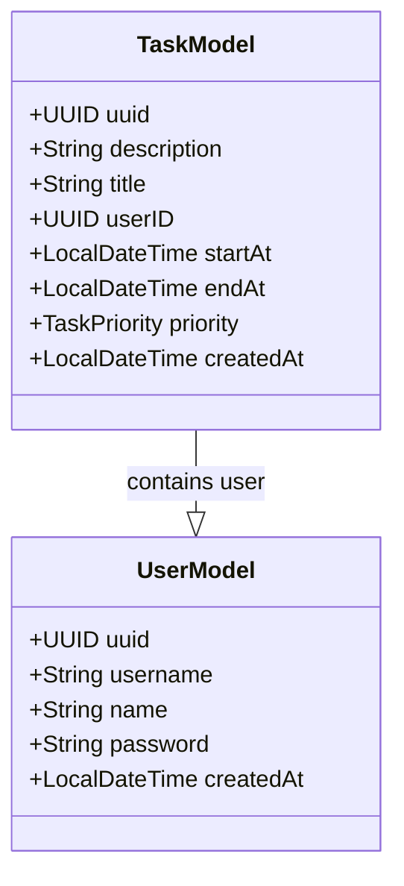

# Projeto TODO
Esse projeto é parte dos estudos realizados durante o evento Curso online de Java, promovido pela Rocketseat durante 09 a 15 de outubro.

O projeto consiste em uma API para cadastro de Usuário e Tarefas vinculadas a esses usuários. 

Tarefas podem ser listadas, criadas, atualizadas e deletadas, desde que o usuário esteja autenticado e seja dono da tarefa.

## Diagrama de classes


## Como usar a API
### Cria usuário
`POST` /users

Exemplo de request:
```json
{
	"name":"John Doe", // MAX 80 CHARACTERS
	"username":"johndoe", // MAX 50 CHARACTERS 
	"password":"donttellanyone"
}
```
-------
### Lista usuários
`GET` /users

-------

### Cria tarefa
`POST` /tasks

Exemplo de request:
```json
{
	"description": "Your best description",
	"title": "You new task", // MAX 50 CHARACTERS
	"startAt": "2024-10-14T14:46:00",
	"endAt": "2024-10-15T14:46:00",
	"priority": "HIGH" // HIGH, MEDIUM OR LOW
}
```

-------

### Busca tarefa
`GET` /tasks

-------

### Busca tarefa por ID
`GET` /tasks/`id`

-------

### Atualiza tarefa
`PUT` /tasks/`id`

Exemplo de request:
```json
{
	"description": "Updating my old task",
	"title": "Task updated",
	"startAt": "2024-10-14T14:46:00",
	"endAt": "2024-10-15T14:46:00",
	"priority": "HIGH"
}
```

------

### Deleta tarefa
`DELETE` /tasks/`id`

## Tecnologias utilizadas
- Java 17
- Spring Boot
- Spring JPA
- Spring Validator
- Spring DevTools
- Lombok
- H2 Database
- BCrypt

## Deploy
https://todolist-t3bs.onrender.com